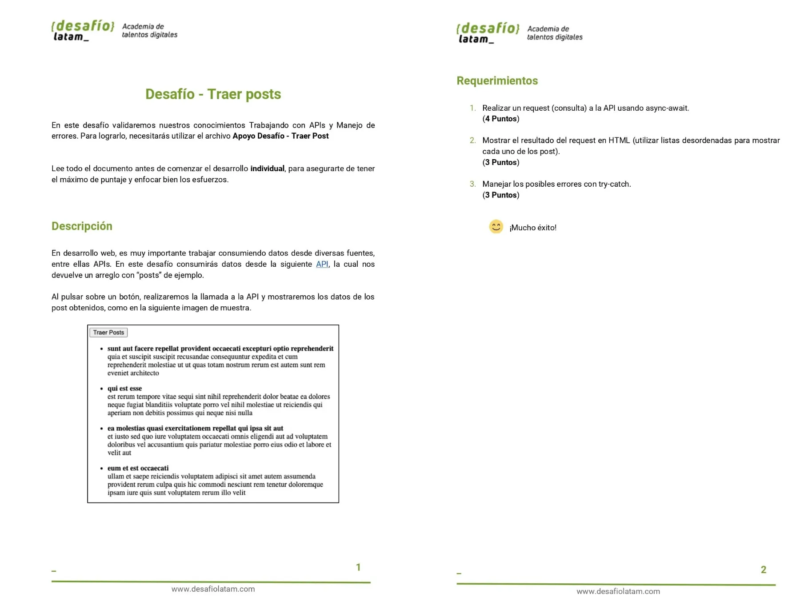
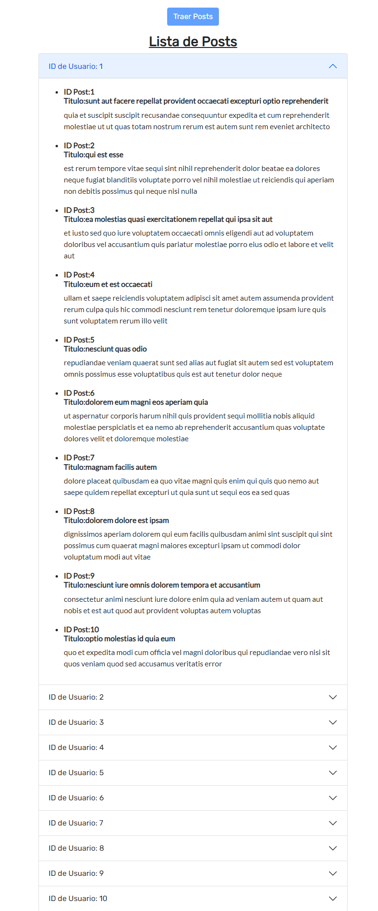
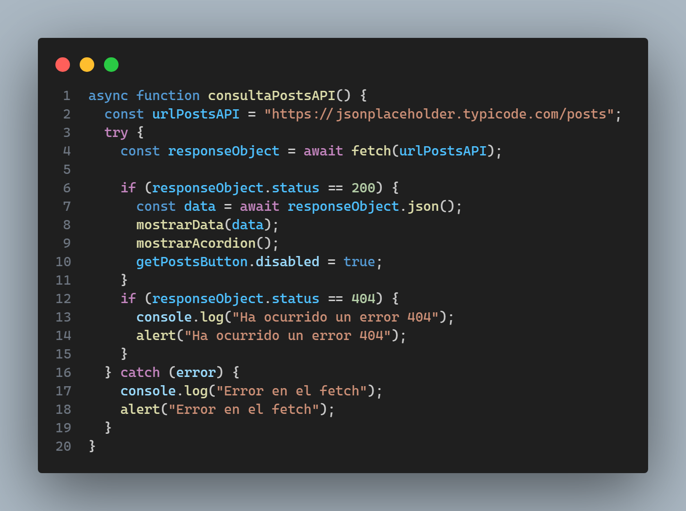
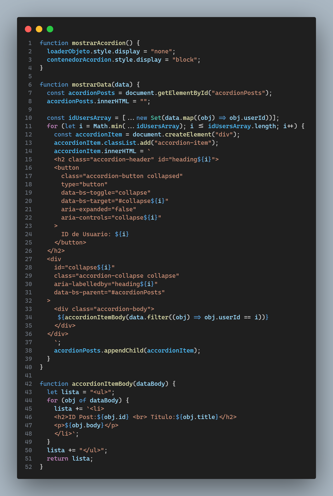

El presente repositorio contiene el código del **sexto desafío** llamado **Traer Posts** del módulo **Programación avanzada en JavaScript** de la beca **Desarrollo de aplicaciones Full Stack Javascript Trainee** dictada por Desafío Latam.

Los requisitos del proyecto son los siguientes:

La API de consulta se encuentra [aquí](https://jsonplaceholder.typicode.com/posts)

El proyecto presenta 2 estados siendo el primero aquel que presenta el botón Traer Posts Habilitado para hacer click sobre él. El segundo estado es aquel que se gatilla cuando se muestra la data en pantalla en el cual el botón Traer Posts se deshabilita. El estado 1 esta representado por la imagen siguiente:

El estado 2 el cual muestra data es representado por la imagen siguiente:

La data de la API la muestro en un acordion de bootstrap 5.

A continuación muestro el código para cada requisito:

#### 1.Realizar un request (consulta) a la API usando async-await.

#### 2.Mostrar el resultado del request en HTML (utilizar listas desordenadas para mostrar cada uno de los post).

#### 3.Manejar los posibles errores con try-catch.

El manejo de errores ya sea error 404 o errores de otro tipo son manejados por un bloque de try y catch que muestran una descripción del error ya sea por medio de una alerta y por consola .
